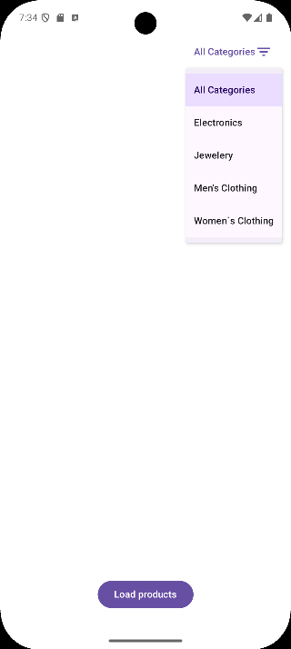
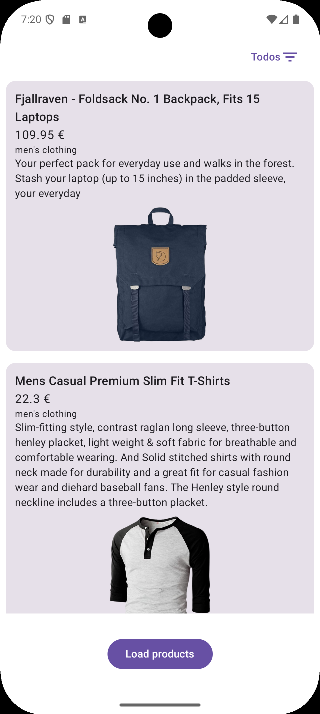

# Product List Compose

A modern Android portfolio project built with **Kotlin** and **Jetpack Compose**. This project serves as a showcase of my journey learning Android development, from basic concepts to advanced API integrations and UI polishing.

---

## 📅 Version History & Milestones

### v2.0 - Networking & Professional UX (Current)
*The app evolved from a static prototype to a dynamic, connected application.*

<p align="center">
  
  &nbsp;&nbsp;
  
  &nbsp;&nbsp;
</p>

- **API Integration:** Replaced simulated data with real-time fetching from the **FakeStore API** using **Retrofit** and **GSON**.
- **Dynamic Filtering:** Implemented a category-based filter system using Material 3 `DropdownMenu`.
- **Image Loading:** Integrated **Coil** for efficient and smooth remote image rendering.
- **Visual Polish:** Added full **Edge-to-Edge** support (`statusBarsPadding`, `navigationBarsPadding`) and refined the Material 3 styling for both light and dark modes.
- **Robust Error Handling:** Improved state management to handle network timeouts and API errors gracefully.

### v1.0 - Initial Prototype & Architecture
*The foundation of the project.*

- **Architecture Setup:** Established a clean **MVVM** pattern separating data, logic, and UI.
- **State Management:** Implemented `ViewModel` and `StateFlow` to manage the UI state reactively.
- **Simulated Asynchrony:** Used Kotlin Coroutines and `delay` to simulate network calls and test UI states (Loading, Success, Error).
- **Basic UI:** Created the first product list using `LazyColumn` and basic Material 3 cards.

---

## 🚀 Features

- **Dynamic Data:** Real-time product fetching from a REST API.
- **Category Filter:** Quick filtering to browse specific types of products.
- **Immersive UI:** A modern design that respects the system's status and navigation bars.
- **Responsive State:** Instant visual feedback for loading, success, and error scenarios.
- **Clean Code:** Adherence to modern Android architectural best practices.

## 🛠️ Tech Stack

- **Kotlin** & **Coroutines**
- **Jetpack Compose** (UI)
- **Material 3** (Design)
- **Retrofit** & **GSON** (Networking)
- **Coil** (Images)
- **ViewModel** & **StateFlow** (State)
- **Gradle Version Catalog** (Dependencies)

## 🏗️ Architecture

```text
data/
├── model/           # Data classes
├── remote/          # Retrofit API interface & client
└── repository/      # Data source abstraction

ui/productos/        # UI layer (Screen, ViewModel, UI State)
```

## 🏃 Running the project

1. Clone the repository.
2. Open it in Android Studio.
3. Allow Gradle to synchronize dependencies.
4. Run the `app` configuration (requires internet access).

## 📌 Project Status

Continuously evolving. Future steps include Dependency Injection (Hilt), Unit Testing, and Room persistence.

## 📸 Screenshots (Original Version)

<p align='center'>
  
  &nbsp;&nbsp;
  
</p>

## 👤 Author

Eduardo Pinto
