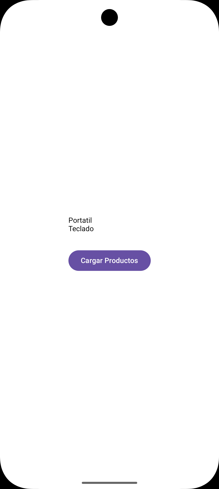

# Product List Compose

A small Android portfolio project built with Kotlin and Jetpack Compose. The app simulates loading a list of products and demonstrates a clear separation between the UI, state holder, repository, and data model.

## Features

- Displays a product list in a Compose UI
- Shows a progress indicator while data is loading
- Represents loading, success, and error UI states
- Reloads the product list from a button
- Simulates asynchronous work with Kotlin coroutines
- Keeps screen state in a `ViewModel` using `StateFlow`

## Tech stack

- Kotlin
- Jetpack Compose
- Material 3
- Android ViewModel
- Kotlin Coroutines
- StateFlow
- Gradle version catalog

## Architecture

The project uses a simple MVVM-style structure:

```text
data/
├── model/Producto.kt
└── repository/ProductosRepository.kt

ui/productos/
├── ProductosScreen.kt
├── ProductosUiState.kt
└── ProductosViewModel.kt
```

`ProductosRepository` provides the sample data, `ProductosViewModel` coordinates asynchronous loading and exposes an immutable UI state, and `ProductosScreen` renders the current state.

## Running the project

1. Clone the repository.
2. Open it in Android Studio.
3. Allow Gradle to synchronize the dependencies.
4. Run the `app` configuration on an emulator or Android device running Android 9 (API 28) or later.

No API keys, external services, or additional configuration are required.

## Project status

This is a learning and portfolio project. Possible future improvements include adding navigation, persistent local storage, automated ViewModel tests, dependency injection, and a more detailed product interface.

## Screenshots

### Loading state


### Product list



## Author

Eduardo Pinto

